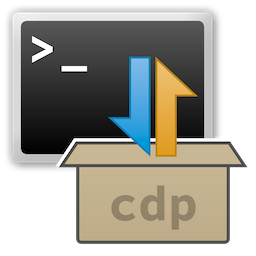

# *cdeploy* – Ein leichtgewichtiges Installationssystem für Bash-kompatible Systeme

**Summary**  
*cdeploy* is a fully shell-based, Bash-compatible installation system that can install, update, and remove software packages. It relies solely on standard Unix commands and requires no external dependencies. The system is transparent, predictable, and portable — ideal for minimalist environments, custom projects, or systems without a package manager.

For now, this software is available in German only.
   
   

**Zusammenfassung**  
*cdeploy* ist ein vollständig in Shell realisiertes, Bash-kompatibles Installationssystem,
das Softwarepakete installieren, aktualisieren und entfernen kann. Es verwendet ausschließlich Standard-Unix-Befehle und benötigt keine externen Abhängigkeiten. Das System ist transparent, nachvollziehbar und portabel – ideal für minimalistische Umgebungen, eigene Projekte oder Systeme ohne Paketmanager.


## Ziele und Philosophie

Die Idee hinter *cdeploy* ist ein einfach zu bedienendes Hilfswerkzeug für Administratoren zu entwickeln, das diese bei der Wartung und Installation von Rechnern unterstützt. Das Skript soll den Anwender größtmöglich unterstützen, ohne ihn einzuschränken. Um dieses Ziel zu erreichen, standen bei der Entwicklung folgende Punkte im Vordergrund:

- **Einfache Nutzung:** einfache Verzeichnisse oder Archivdateien als Installationspakete
- **Portabilität** auf möglichst alle Unix-artigen Betriebssysteme
- **POSIX-Kompatibilität** als Ziel für Version 1.1 (bis dahin Bash-kompatibel)
- **Keine externen Abhängigkeiten,** es werden nur Standard-Unix-Tools verwendet
- **Sauberes Fehlermanagement** mit klaren Meldungen über eine zentrale Fehlerroutine
- **Volle Nachvollziehbarkeit** der Installationen durch Manifeste mit Hashwerten
- **Kein Root-Zwang,** funktioniert auch als normaler Benutzer
- **Transparente Architektur,** vollständig in Shell geschrieben
- **Hooks** zur flexiblen Erweiterung des Installationsprozesses
- **Absicherung gegen Bedienfehler** durch Warnmeldungen und -dialoge
- **Verwendbarkeit in Skripten** durch komplette Unterdrückung der Ausgabe
- **Einfache Erweiterbarkeit** um neue Funktionen


## Architekturüberblick

- Vollständig in Shell geschrieben. Aktuell Bash-kompatibel, für die nächste Version ist vollständige POSIX-Kompatibilität angestrebt
- Zentrale Methoden zur Ausgabe von Informationen, Warn- und Fehlermeldungen: `cdepShowMsg`, `cdepShowWarning` und `cdepShowError`.
- Zentrale Methode zum Ausführen von Dateioperationen: `cdepSafeRun`.
- Automatisches herunterladen von Paketen, wenn diese als URL angegeben werden (`http`, `https`, `ftp`, `file`).
- Automatisches entpacken von Installationspaketen, wenn diese als Archiv anstatt eines offenen Verzeichnisses übergeben werden.
- Automatisches Anlegen von Manifesten zum Nachvollziehen von Installationen.
- Hooks für die individuelle Erweiterung der Befehle `install` und `remove`.
- API für die Hook-Programmierung.
- Abfangen von Shell-Signalen per `trap` zum Entfernen temporärer Dateien beim Beenden und bei einem Skriptabbruch.


### Paketstruktur

Eine typische Paketstruktur sieht folgendermaßen aus:

<table class="tree">
    <tr>
        <td class="content" colspan="5">[Paketname]</td>
    </tr>

    <tr>
        <td class="tree_v"></td>
        <td class="tree_h"></td>
        <td class="content" colspan="3" rowspan="2">cdeploy.conf</td>
        </tr>
        <tr>
        <td class="tree_v"></td>
        <td></td>
    </tr>

    <tr style="border: 0;">
        <td class="tree_v"></td>
        <td class="tree_h"></td>
        <td class="content" colspan="3" rowspan="2">bin&thinsp;/</td>
        </tr>
        <tr>
        <td class="tree_v"></td>
        <td></td>
    </tr>

    <tr style="border: 0;">
        <td class="tree_v"></td>
        <td class="tree_h"></td>
        <td class="content" colspan="3" rowspan="2">etc&thinsp;/</td>
        </tr>
        <tr>
        <td class="tree_v"></td>
        <td></td>
    </tr>

    <tr>
        <td class="tree_v"></td>
        <td class="tree_h"></td>
        <td class="content" colspan="3" rowspan="2">files&thinsp;/</td>
        </tr>
        <tr>
        <td class="tree_v"></td>
        <td></td>
    </tr>

    <tr>
        <td class="tree_v"></td>
        <td></td>
        <td class="tree_v" style="width: 1em;"></td>
        <td class="tree_h"  ></td>
        <td class="content" rowspan="2">files.conf</td>
        </tr>
        <tr>
        <td class="tree_v" style="width: 1em;"></td>
        <td></td>
        <td></td>
        <td></td>
    </tr>

    <tr>
        <td class="tree_v"></td>
        <td class="tree_h"></td>
        <td class="content" colspan="3" rowspan="2">lib&thinsp;/</td>
        </tr>
        <tr>
        <td class="tree_v"></td>
        <td></td>
    </tr>

    <tr>
        <td class="tree_v"></td>
        <td class="tree_h"></td>
        <td class="content" colspan="3" rowspan="2">man&thinsp;/</td>
        </tr>
        <tr>
        <td ></td>
        <td></td>
    </tr>
</table>

Die Verzeichnisse `bin`, `etc` und `lib` werden in ein Paket-Verzeichnis kopiert, das speziell für dieses Paket angelegt wird. `man` wird abhängig von der Installation in das lokale bzw. globale `man`-Verzeichnis kopiert.

Das Verzeichnis `files` ist für Dateien gedacht, die an Orten außerhalb des Paket-Verzeichnisses liegen müssen. Ihr Zielverzeichnis wird in der Datei `files.conf` definiert. Dazu wird pro Datei im Verzeichnis `files` eine Zeile angelegt, die zuerst den Dateinamen, dann ein Tab-Zeichen und dann den Zielpfad (relativ oder absolut) enthält. Wenn die Zielverzeichnisse nicht existieren, werden sie bei der Installation angelegt. Die Datei `files.conf` darf Leer- und Kommentarzeilen (beginnen mit einem `#`) enthalten.

```bash
# Syntax der Datei 'files.conf'

<dateiname>\t<zielpfad>
```

***Es können keine kompletten Verzeichnisse kopiert werden! Alle Dateien in Unterverzeichnissen müssen einzeln aufgeführt werden.***


### Hooks und Parameter

Hooks erweitern die Funktionalität eines Pakets, z. B. durch eigene Aktionen vor oder nach der Installation. *cdeploy* überstütz dabei auch individuelle Parameter für Hooks, die über die Option `--hook-parameter` bzw. `-p` definiert werden. Hook-Parameter bestehen aus Schlüssel-Werte-Paaren. Der Schlüssel beginnt mit dem Paragraphenzeichen (`§`), weshalb dieses Zeichen nicht im Schlüssel oder Wert vorkommen darf. Nach dem Schlüssel kommt ein Gleichheitszeichen (`=`) und dann der Wert. Wenn der Wert Leerzeichen enthält, muss er mit einfachen (`''`) oder doppelten (`""`) Anführungszeichen umschlossen werden. Im ersten Fall dürfen die Werte keine einfachen, im zweiten Fall keine doppelten Anführungszeichen enthalten. Das jeweils gegenteilige Anführungszeichen ist aber erlaubt!

```bash
# Ein Beispiel für individuelle Hook-Parameter. Achten Sie beim 'password'
# auf die Verwendung von einfachen Anführungszeichen innerhalb von Doppelten.
# Der umgekehrte Fall ist ebenfalls möglich.

cdeploy install -p="§user='demo' §password="Das Passwort ist 'secret'!" ..."
```

Das Paragraphenzeichen (`§`) wurde als Markierung für den Schlüssel gewählt, weil es einerseits im Standard ASCII-Breich liegt, es andererseits aber relativ selten verwendet wird und unter POSIX/Bash keine besondere Bedeutung hat.

Hooks können die Werte von Hook-Parametern mit der Funktion `cdepGetHookParameter` abrufen. Die Methode erwartet als ersten Parameter den Schlüssel. Im optionalen zweiten Methoden-Parameter kann ein Standardwert übergeben werden, für den Fall dass der Hook-Parameter nicht übergeben wurde. Wenn kein Standardwert übergeben wird, liefert die Methode stattdessen einen leeren String.

```bash
# Wenn ein Hook-Parameter "user" existiert, wird dessen Wert zurückgegeben,
# andernfalls der Standardwert "defaultuser"

username=$(getHookParam "user" "defaultuser")
```


#### Öffentliche Hook-API

Für Hook-Entwickler stellt *cdeploy* definierte Umgebungsvariablen bereit, z. B. für Paketpfade, Manifest-Positionen oder Installationskontexte. Eine vollständige Beschreibung der API befindet sich in der Man-Page.


##### Konstanten
Konstanten in der Hook-API beginnen immer mit dem Präfix `_CDEP_` und werden immer komplett in Großbuchstaben geschrieben. Sie lassen sich durch den Unterstrich (`_`) direkt am Anfang von normalen Variablen unterscheiden.

- `_CDEP_SCRIPT_NAME="cdeploy"`
- `_CDEP_SCRIPT_VERSION=<aktuelle_Skript-Versionsnummer>`
- `_CDEP_PACK_EXT=".cdp"        # Extension für Paket-Archive`
- `_CDEP_PACK_EXT_RE="\\.cdp"   # ...zur Verwendung mit RegEx`
- `_CDEP_SHELL_BIN="${SHELL:-/bin/sh}"`


##### Variablen
Globale Variablen der Hook-API beginnen immer mit dem Präfix `CDEP` und werden ebenfalls immer komplett in Großbuchstaben geschrieben. Im Vergleich zu den Konstanten beginnen sie nicht mit einem Unterstrich (`_`).

- `CDEP_PACKAGE_NAME="tools"         # Name des Installationspakets`
- `CDEP_PACKAGE_VERSION=""           # Versionsnummer des Installationspakets`
- `CDEP_PACKAGE_CREATOR=""           # Ersteller des Installationspaketss`
- `CDEP_PACKAGE_URL=""               # URL/Quelle des Installationspakets`
- `CDEP_PACKAGE_COPYRIGHT=""         # Copyright-Information des Installationspakets`
- `CDEP_PACKAGE_DESCRIPTION=""       # Beschreibung des Installationspakets`
- `CDEP_BASE_GLOBAL="/usr/local"     # Basisverzeichnis für eine globale Installation`
- `CDEP_BASE_LOCAL="$HOME/.local"    # Basisverzeichnis für eine lokale Installation`


##### Methoden
Die Methoden der Hook-API beginnen immer mit dem Präfix `cdep` und verwenden die *camelCase*-Schreibweise.

- `cdepGetBaseTarget`  
    Das Basisverzeichnis für die Installation/das Entfernen eines Pakets.
- `cdepGetHookParameter <parameter-name> [default-wert]`  
    Liefert den Wert eine Hook-Parameters.
- `cdepGetPackageInfo [divider]`  
    Liefert den Namen und die Versionsnummer des Pakets.
- `cdepSafeRun <command> ['MSG:'<success-message>]`  
    Führt einen Unix-(Datei-)Befehl aus, und gibt ggf. eine Fehler- oder Erfolgsmeldung aus.
- `cdepShowError <error-code> [message ...]`  
    Gibt eine Fehlermeldung aus, die aus mehreren Zeilen bestehen kann. Wenn `error-code` ungleich `0` ist, wird das Skript abgebrochen.
- `cdepShowMsg [message ...]`  
    Gibt eine normale Meldung aus, die aus mehreren Zeilen bestehen kann.
- `cdepShowWarning [message ...]`  
    Gibt eine Warnmeldung aus, die aus mehreren Zeilen bestehen kann.


## Abläufe


### Installation

1. Parameterprüfung
2. sudo-Abfrage grundsätzlich bei globaler Installation oder wenn einzelne Zielverzeichnisse es erfordern
3. Hook-Warnung und Bestätigung
4. Hooks sichern (falls Remove-Hooks vorhanden)
5. PreInstall-Hook ausführen
6. Paketdateien kopieren (nur Ältere ersetzen durch `cp -u`)
7. PostInstall-Hook ausführen
8. Cleanup temporärer Dateien


### Entfernen eines Pakets

1. Parameterprüfung
2. sudo-Abfrage grundsätzlich bei globaler Installation oder wenn einzelne Zielverzeichnisse es erfordern
3. Manifeste laden (lokal & global)
4. Sicherheitsabfrage (Bestätigung mit „ja“)
5. Hooks laden, wenn vorhanden
6. Dateien entfernen
    1. Hash-Überprüfung (geänderte Dateien werden nur gelöscht, wenn die Option `--force` verwendet wird)
    2. Prüfung auf mehrfache Verwendung durch verschiedene Versionen eines Pakets (mehrfach verwendete Dateien werden **nicht** gelöscht)
    3. Datei löschen
    4. Eltern-Verzeichnis entfernen, wenn leer (`rmdir`)
7. Hooks und Manifest löschen, wenn alle Dateien entfernt wurden
8. Cleanup temporärerDateien
9. Fehlerauswertung bei Konflikten


## Man-Page

Die Hilfeseite wird direkt aus dem Skript heruas als Man-Page zur Verfügung gestellt. Das ist Teil der Strategie zur vollständigen Selbständigkeit des Skripts, ein Installationsvorgang ist somit überflüssig.  Die Seite beschreibt alle Befehle, Optionen und die interne Struktur des Skripts.

```bash
cdeploy help
```


## Lizenz

Dieses Projekt steht unter der MIT-Lizenz. Die vollständige Lizenz befindet sich in der Datei LICENSE im Quellverzeichnis dieses Projektes.

MIT License

Copyright © 2025 Christian Dorn <https://github.com/cdorn-de>

Hiermit wird unentgeltlich jeder Person, die eine Kopie der Software und der zugehörigen Dokumentationsdateien (die „Software“) erhält, die Erlaubnis erteilt, uneingeschränkt mit der Software zu handeln, einschließlich und ohne Einschränkung der Rechte, die Software zu verwenden, zu kopieren, zu modifizieren, zusammenzuführen, zu veröffentlichen, zu vertreiben, zu unterlizenzieren und/oder zu verkaufen, und Personen, denen die Software zur Verfügung gestellt wird, diese Rechte zu gewähren, unter den folgenden Bedingungen:

Der obige Urheberrechtsvermerk und dieser Erlaubnisvermerk sind in allen Kopien oder wesentlichen Teilen der Software beizulegen.

DIE SOFTWARE WIRD OHNE JEDE AUSDRÜCKLICHE ODER IMPLIZIERTE GARANTIE BEREITGESTELLT, EINSCHLIESSLICH ABER NICHT BESCHRÄNKT AUF DIE GARANTIEN DER MARKTREIFE, DER EIGNUNG FÜR EINEN BESTIMMTEN ZWECK UND DER NICHTVERLETZUNG. IN KEINEM FALL SIND DIE AUTOREN ODER URHEBERRECHTSINHABER FÜR ANSPRÜCHE, SCHÄDEN ODER ANDERE HAFTUNGEN VERANTWORTLICH, SEI ES AUFGRUND EINES VERTRAGS, UNERLAUBTER HANDLUNG ODER ANDERWEITIG, DIE AUS ODER IM ZUSAMMENHANG MIT DER SOFTWARE ODER DER VERWENDUNG ODER ANDEREN GESCHÄFTEN MIT DER SOFTWARE ENTSTEHEN.


## Kontakt

Projektseite: https://github.com/cdorn_de/cdeploy


## Nächste Schritte

- Das Skript soll vollständig POSIX-kompatibel werden
- Angleichen der Installation von man-Pages an die der bin-Dateien
- Testskripte für typische Szenarien (install, update, remove)
